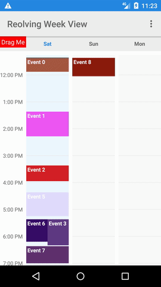

Some bugs might still get fixed, as we are still using this library. But we do not have the time or in-house skills to actively maintain it.

Revolving Week View (Android)
===

**Android Week View** is an android library to display a static week calendar with options of viewing 1-7 days of the week at a time.

	

Features
---

* Choose from 1-7 viewing days
* Custom styling
* Vertical scrolling and zooming
* Possibility to set min and max day of the week
* Possibility to set range of visible hours
* Drag and drop a View into an area in the calendar

Getting Started
---
Write the following code in your layout file

    <com.jin.WeekView
      android:id="@+id/revolving_weekview"
      android:layout_width="match_parent"
      android:layout_height="match_parent"
      app:eventTextColor="@android:color/white"
      app:hourHeight="60dp"
      app:headerColumnPadding="8dp"
      app:headerColumnTextColor="#8f000000"
      app:headerRowPadding="12dp"
      app:noOfVisibleDays="3"
      app:headerRowBackgroundColor="@color/color_accent"
      app:dayBackgroundColor="#05000000"
      app:todayBackgroundColor="#1848adff"
      app:headerColumnBackground="#ffefefef"
      />
Write the following in your activity

        // Get a reference for the week view in the layout.
        mWeekView = (WeekView) findViewById(R.id.revolving_weekview);

        // Set an WeekViewLoader to draw the events on load.
        mWeekView.setWeekViewLoader(new WeekView.WeekViewLoader() {

	        @Override
		public List<? extends WeekViewEvent> onWeekViewLoad() {
		    List<WeekViewEvent> events = new ArrayList<>();
	            // Add some events
	            return events;
	        }
	    });
	    // There are many other Listeners to choose from as well.

### This libs is convert form Java to Kotlin, fork form [jlurena-lib](https://github.com/jlurena/revolvingweekview).
### Converter: [PNThang](https://github.com/PNThanggg), Modify: me - doanvu2000
